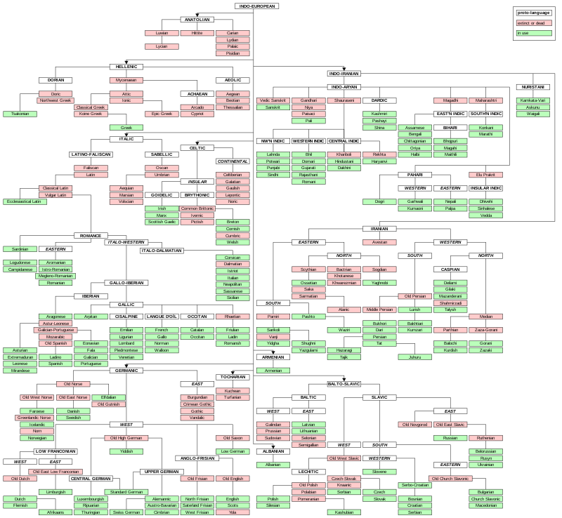

# Introduction to Proto-Indo-European Linguistics

Thank you to wikipedia, chatgpt, if you find errors in this, blame them. 

---

## What is Proto-Indo-European?

- (almost) all languages of europe are related and northern india languages
- Proto-Indo-European (PIE) is the hypothetical common ancestor of the Indo-European language family.
- spoken before the invention of writing but reconstructed using the comparative method.

## History of PIE
  

### Discovery of similarities with European languages.
- Europeans had been studying latin and ancient greek
- really complicated grammar (for English speakers at least)
- after they discovered sanskrit, they found certain similarities that they were able to connect them
- also later tied Germanic, Slavic into the mix
- Later discovered tocharian and hittite

### Grimm's law
- How they got Germanic involved

### Grimm's Law: Detailed Overview

In techenical terms, it is a chain shift voiced plosives -> voiced plain stops -> voiceless stops -> voicless fricative

 
  - **Voiceless Stops to Voiceless Fricatives**:
    - _Example 1_: PIE *p → Proto-Germanic *f

      Compare latin root pes vs English foot
       
    - _Example 2_: PIE *t → Proto-Germanic *θ (as in "th")
      Compare latin root tres vs english three
    - _Example 3_: PIE *k → Proto-Germanic *h
      Latin: centum vs english hundred

  - **Voiced Stops to Voiceless Stops**:
    - _Example 2_: PIE *d → Proto-Germanic *t
    latin: dens vs English tooth
    - _Example 3_: PIE *g → Proto-Germanic *k
   latin: genus vs English kin

  - **Aspirated Stops to Voiced Stops**:
    - _Example 1_: PIE *bʰ → Proto-Germanic *b
    latin: frater English brother

   Someone come up with more examples.

   

## Basic Features of PIE

### Phonology
- Rich consonantal system.
- Lots of throating sounds
   - velars can be palatal, plain, or labialized
   - additionally, there are three voicings of plain, voiced, or voiced aspirated
   - giving 9 total velars
    - Three laryngeal sounds, although their exact articulation is uncertain.

### Morphology
- Noun inflections for cases, numbers, and genders.
- Verb conjugations based on tense, mood, voice, and person.

 

